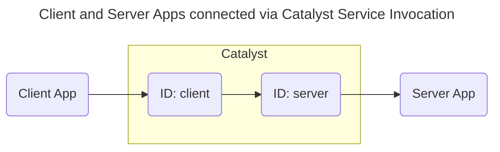

# Quickstart: Service Invocation (Python)

In this quickstart, you'll run a client and server application on [Catalyst Cloud](https://docs.diagrid.io/operate/hosting/catalyst-cloud). You will learn how to:

- Provision a Catalyst project with apps for two applications using the Diagrid CLI.
- Invoke a remote service method from a client application using the Dapr Service Invocation API.
- Verify successful service-to-service communication in the application logs and the Catalyst web console.



## 1. Prerequisites

Before you proceed, ensure you have the following prerequisites installed.

- [Diagrid Catalyst account](https://catalyst.diagrid.io/)
- [Diagrid CLI](https://docs.diagrid.io/getting-started/install-cli)
- [Git](https://git-scm.com/downloads)
- [Python 3.12+](https://www.python.org/downloads/) & [uv](https://docs.astral.sh/uv/#installation)

## 2. Log in to Catalyst

Authenticate to Diagrid Catalyst using the following command:

```bash
diagrid login
```

This command opens a new browser window where you'll be shown a confirmation code that should match the code in your terminal. Confirm the code, and if you're not logged into Catalyst, you'll be redirected to login.

Confirm your user details are correct using the following command:

```bash
diagrid whoami
```

The expected output contains the name of the organization, your user name, and the Catalyst API endpoint.

## 3. Clone Quickstart Code

Clone the quickstart code from GitHub:

```bash
git clone https://github.com/diagridio/catalyst-quickstarts
```

Navigate to the quickstart directory:

**macOS/Linux:**

```bash
cd catalyst-quickstarts/invocation/python
```

**Windows:**

```powershell
cd catalyst-quickstarts\invocation\python
```

## 4. Install Dependencies

Install the dependencies for both the client and server applications.

```bash
uv sync --all-packages
```

## 5. Run the application with Catalyst Cloud

The `diagrid dev run` command creates your Catalyst project, provisions resources (apps), configures environment variables, and launches your application connected to Catalyst Cloud.

```bash
uv run diagrid dev run -f invocation-quickstart.yaml --project invocation-quickstart --approve
```

> **Tip:** Wait until you see the log `Connected App ID "server" to http://localhost:5002` in the terminal before proceeding, to ensure both applications are up and running. That line means the server app is connected, but Catalyst needs a few more seconds after it before invocations can be routed to the app: if the request in step 6.1 returns an error instead of the response shown there, wait a few seconds and send it again.

## 6. Invoke the service

With the quickstart running, test the Service Invocation API by sending a request from the client app to the server app.

### 6.1 Send a request

Open a new terminal and invoke the server app through the client app:

**macOS/Linux (curl):**

```bash
curl -i -X POST http://localhost:5001/order -H "Content-Type: application/json" -d '{"orderId":1}'
```

**Windows (PowerShell):**

```powershell
Invoke-RestMethod -Method Post -Uri "http://localhost:5001/order" -ContentType "application/json" -Body '{"orderId":1}'
```

**Any OS (VS Code REST Client):** open [`test.rest`](./test.rest) and click *Send Request* above the request. Requires the [REST Client](https://marketplace.visualstudio.com/items?itemName=humao.rest-client) extension.

The expected response is `200 OK` with this body:

```json
{"message":"Invocation successful","orderId":1,"targetApp":"server"}
```

In the `diagrid dev run` terminal, the server app logs should indicate the request was successfully received, and the client app logs should show the invocation was successful.

### 6.2 View in the Catalyst web console

Open the [Catalyst Cloud web console](https://catalyst.diagrid.io/call-graph) and navigate to the Topology section, which visualizes the communication between the `client` and `server` applications.

## 7. Clean Up

Press CTRL+C in the terminal that runs `diagrid dev run` to stop the application and disconnect from Catalyst Cloud.

To delete the entire project and all provisioned resources:

```bash
diagrid project delete invocation-quickstart
```

## Summary

In this quickstart you:

- Logged in to Catalyst and provisioned a managed service invocation project with a single CLI command (`diagrid dev run`).
- Invoked a remote server method from a client application using the Dapr Service Invocation API.
- Verified service-to-service communication through application logs and the Catalyst web console.

Catalyst handled service discovery, routing, and secure communication automatically — no infrastructure to manage.

## Next steps

- Explore the [Dapr API SDK guides](https://docs.diagrid.io/develop/dapr-apis) to integrate service invocation into your own applications.
- Try the [Pub/Sub quickstart](https://docs.diagrid.io/getting-started/quickstarts/dapr-apis/pubsub) to add event-driven messaging between your services.
- Read the full [Service Invocation quickstart docs](https://docs.diagrid.io/getting-started/quickstarts/dapr-apis/invocation).
- Browse all [Catalyst quickstarts](../../README.md) in this repository.
