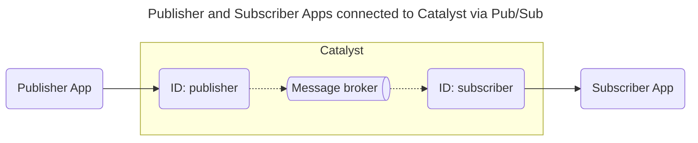

# Quickstart: Publish/Subscribe (Java)

In this quickstart, you'll run a publisher and subscriber application on [Catalyst Cloud](https://docs.diagrid.io/operate/hosting/catalyst-cloud). You will learn how to:

- Provision a Catalyst project with a managed message broker using the Diagrid CLI.
- Publish messages to a topic and receive them in a subscriber application using the Dapr Pub/Sub API.
- Inspect published messages in the Catalyst web console.



## 1. Prerequisites

Before you proceed, ensure you have the following prerequisites installed.

- [Diagrid Catalyst account](https://catalyst.diagrid.io/)
- [Diagrid CLI](https://docs.diagrid.io/getting-started/install-cli)
- [Git](https://git-scm.com/downloads)
- Java 17+: [OracleJDK](https://www.oracle.com/java/technologies/downloads/) or [OpenJDK](https://jdk.java.net/)
- [Apache Maven 3.9.5+](https://maven.apache.org/download.cgi)

## 2. Log in to Catalyst

Authenticate to Diagrid Catalyst using the following command:

```bash
diagrid login
```

This command opens a new browser window where you'll be shown a confirmation code that should match the code in your terminal. Confirm the code, and if you're not logged into Catalyst, you'll be redirected to login.

Confirm your user details are correct using the following command:

```bash
diagrid whoami
```

The expected output contains the name of the organization, your user name, and the Catalyst API endpoint.

## 3. Clone Quickstart Code

Clone the quickstart code from GitHub:

```bash
git clone https://github.com/diagridio/catalyst-quickstarts
```

Navigate to the quickstart directory:

**macOS/Linux:**

```bash
cd catalyst-quickstarts/pubsub/java
```

**Windows:**

```powershell
cd catalyst-quickstarts\pubsub\java
```

## 4. Install Dependencies

Install the dependencies for both the publisher and subscriber applications.

```bash
mvn clean install -f ./publisher && mvn clean install -f ./subscriber
```

## 5. Run the application with Catalyst Cloud

The `diagrid dev run` command creates your Catalyst project, provisions resources (apps, Diagrid Pub/Sub service and topic), configures environment variables, and launches your application connected to Catalyst Cloud.

```bash
diagrid dev run -f pubsub-quickstart.yaml --project pubsub-quickstart --approve
```

> **Tip:** Wait a few seconds until you see the logs `Connected App ID "publisher" to localhost:5001` and `Connected App ID "subscriber" to localhost:5002` in the terminal before proceeding, to ensure both applications are up and running.

## 6. Publish and receive a message

With the quickstart running, test the Pub/Sub API by publishing a message and verifying it was received by the subscriber.

### 6.1 Publish a message

Open a new terminal and publish an order message to the `orders` topic:

**macOS/Linux (curl):**

```bash
curl -i -X POST http://localhost:5001/order -H "Content-Type: application/json" -d '{"orderId":1}'
```

**Windows (PowerShell):**

```powershell
Invoke-RestMethod -Method Post -Uri "http://localhost:5001/order" -ContentType "application/json" -Body '{"orderId":1}'
```

**Any OS (VS Code REST Client):** open [`test.rest`](./test.rest) and click *Send Request* above the request. Requires the [REST Client](https://marketplace.visualstudio.com/items?itemName=humao.rest-client) extension.

The expected response is `201 Created` with this body:

```json
{"id":"1","message":"Message published successfully","topic":"orders"}
```

In the `diagrid dev run` terminal, the publisher app logs should indicate a message was successfully published, and the subscriber app logs should show the message was received on its `/neworder` route.

### 6.2 View in the Catalyst web console

Open the [Catalyst Cloud web console](https://catalyst.diagrid.io/pub-sub/pubsub) and navigate to the Pub/Sub topic explorer (Resources > Managed Pub/Sub). When the `Pending Message Count` for the `orders` topic reaches 0, the subscriber app has successfully processed all messages.

## 7. Clean Up

Press CTRL+C in the terminal that runs `diagrid dev run` to stop the application and disconnect from Catalyst Cloud.

To delete the entire project and all provisioned resources:

```bash
diagrid project delete pubsub-quickstart
```

## Summary

In this quickstart you:

- Logged in to Catalyst and provisioned a managed Pub/Sub project with a single CLI command (`diagrid dev run`).
- Published a message to a topic and verified it was received by a subscriber application.
- Inspected message delivery status using the Catalyst Pub/Sub topic explorer.

Catalyst handled message brokering, topic management, and delivery guarantees automatically — no infrastructure to manage.

## Next steps

- Explore the [Dapr API SDK guides](https://docs.diagrid.io/develop/dapr-apis) to integrate Pub/Sub messaging into your own applications.
- Try the [State Management quickstart](https://docs.diagrid.io/getting-started/quickstarts/dapr-apis/state) to add persistent storage to your application.
- Read the full [Publish/Subscribe quickstart docs](https://docs.diagrid.io/getting-started/quickstarts/dapr-apis/pubsub).
- Browse all [Catalyst quickstarts](../../README.md) in this repository.
