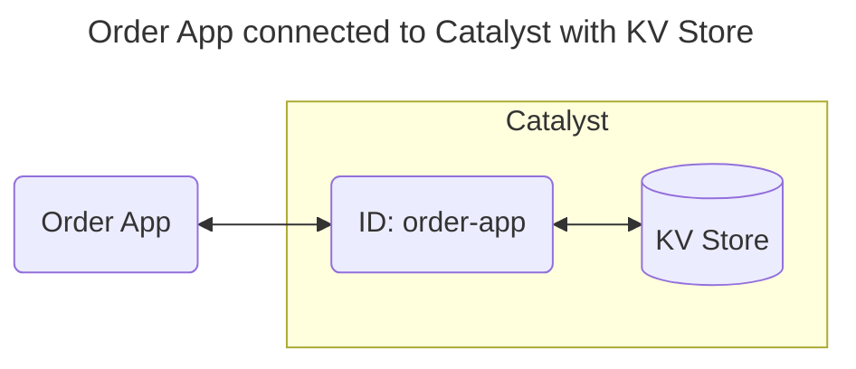

# Quickstart: State Management (JavaScript)

In this quickstart, you'll run a stateful order application on [Catalyst Cloud](https://docs.diagrid.io/operate/hosting/catalyst-cloud). You will learn how to:

- Provision a Catalyst project with a managed KV store using the Diagrid CLI.
- Save and retrieve state items using the Dapr State API.
- Inspect stored data in the Catalyst web console.



## 1. Prerequisites

Before you proceed, ensure you have the following prerequisites installed.

- [Diagrid Catalyst account](https://catalyst.diagrid.io/)
- [Diagrid CLI](https://docs.diagrid.io/getting-started/install-cli)
- [Git](https://git-scm.com/downloads)
- [Node.JS LTS](https://nodejs.org/en/)

## 2. Log in to Catalyst

Authenticate to Diagrid Catalyst using the following command:

```bash
diagrid login
```

This command opens a new browser window where you'll be shown a confirmation code that should match the code in your terminal. Confirm the code, and if you're not logged into Catalyst, you'll be redirected to login.

Confirm your user details are correct using the following command:

```bash
diagrid whoami
```

The expected output contains the name of the organization, your user name, and the Catalyst API endpoint.

## 3. Clone Quickstart Code

Clone the quickstart code from GitHub:

```bash
git clone https://github.com/diagridio/catalyst-quickstarts
```

Navigate to the quickstart directory:

**macOS/Linux:**

```bash
cd catalyst-quickstarts/state/javascript
```

**Windows:**

```powershell
cd catalyst-quickstarts\state\javascript
```

## 4. Install Dependencies

Install the dependencies for the state management application.

```bash
npm install
```

## 5. Run the application with Catalyst Cloud

The `diagrid dev run` command creates your Catalyst project, provisions resources (apps, Diagrid KV Store service), configures environment variables, and launches your application connected to Catalyst Cloud.

```bash
diagrid dev run -f state-quickstart.yaml --project state-quickstart --approve
```

> **Tip:** Wait a few seconds until you see application logs in the terminal to ensure the application is up and running and connected to Catalyst.

## 6. Call the State API

With the quickstart running, test the State API by storing and retrieving a state item.

### 6.1 Store state

Open a new terminal and save a state item to the Diagrid KV store:

**macOS/Linux (curl):**

```bash
curl -i -X POST http://localhost:5001/order -H "Content-Type: application/json" -d '{"orderId":1}'
```

**Windows (PowerShell):**

```powershell
Invoke-RestMethod -Method Post -Uri "http://localhost:5001/order" -ContentType "application/json" -Body '{"orderId":1}'
```

**Any OS (VS Code REST Client):** open [`test.rest`](./test.rest) and click *Send Request* above the request. Requires the [REST Client](https://marketplace.visualstudio.com/items?itemName=humao.rest-client) extension.

The expected response is `201 Created` with this body:

```json
{"id":1,"message":"Order created successfully"}
```

The application logs in the `diagrid dev run` terminal should show an order was saved.

### 6.2 Retrieve state

Confirm the state item was saved successfully by retrieving it:

**macOS/Linux (curl):**

```bash
curl -i -X GET http://localhost:5001/order/1
```

**Windows (PowerShell):**

```powershell
Invoke-RestMethod -Method Get -Uri "http://localhost:5001/order/1"
```

**Any OS (VS Code REST Client):** open [`test.rest`](./test.rest) and click *Send Request* above the request. Requires the [REST Client](https://marketplace.visualstudio.com/items?itemName=humao.rest-client) extension.

The expected response body is:

```json
{"data":{"orderId":1}}
```

### 6.3 View in the Catalyst web console

Open the [KV Store data explorer](https://catalyst.diagrid.io/kv-store/kvstore) in the Catalyst Cloud web console (Resources > Managed KV store) and confirm the key-value pair saved by your application appears.

## 7. Clean Up

Press CTRL+C in the terminal that runs `diagrid dev run` to stop the application and disconnect from Catalyst Cloud.

To delete the entire project and all provisioned resources:

```bash
diagrid project delete state-quickstart
```

## Summary

In this quickstart you:

- Logged in to Catalyst and provisioned a managed state store project with a single CLI command (`diagrid dev run`).
- Saved and retrieved state items using the Dapr State API.
- Inspected stored data using the Catalyst KV Store data explorer.

Catalyst handled state persistence and key-value storage automatically — no infrastructure to manage.

## Next steps

- Explore the [Dapr API SDK guides](https://docs.diagrid.io/develop/dapr-apis) to integrate state management into your own applications.
- Try the [Pub/Sub quickstart](https://docs.diagrid.io/getting-started/quickstarts/dapr-apis/pubsub) to add event-driven messaging to your application.
- Read the full [State Management quickstart docs](https://docs.diagrid.io/getting-started/quickstarts/dapr-apis/state).
- Browse all [Catalyst quickstarts](../../README.md) in this repository.
