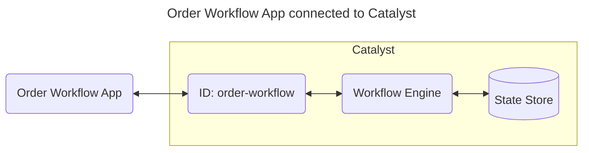
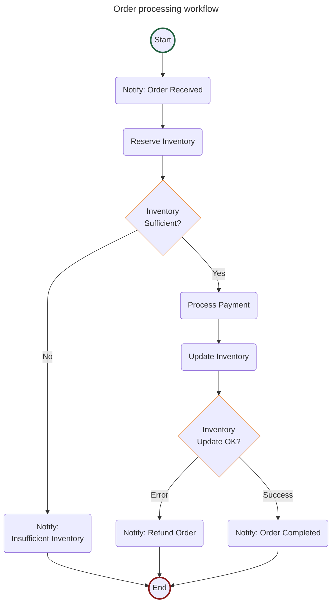
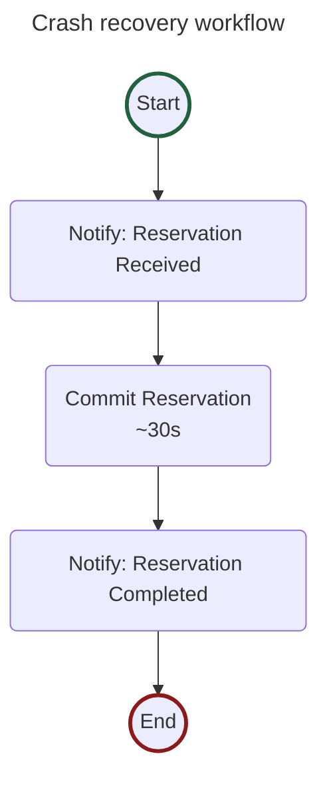

# Quickstart: Workflow (Java)

In this quickstart, you'll run an order processing workflow on [Catalyst Cloud](https://docs.diagrid.io/operate/hosting/catalyst-cloud). You will learn how to:

- Provision a Catalyst project with a managed workflow engine using the Diagrid CLI.
- Run a stateful, multi-step order workflow that chains inventory checking, payment processing, and notification activities.
- Start, monitor, and inspect workflow executions using both the API and the Catalyst web console.
- Recover a workflow after the process is killed mid-run, resuming the same instance under an ID you choose.



## 1. Prerequisites

Before you proceed, ensure you have the following prerequisites installed.

- [Diagrid Catalyst account](https://catalyst.diagrid.io/)
- [Diagrid CLI](https://docs.diagrid.io/getting-started/install-cli)
- [Git](https://git-scm.com/downloads)
- Java 17+: [OracleJDK](https://www.oracle.com/java/technologies/downloads/) or [OpenJDK](https://jdk.java.net/)
- [Apache Maven 3.9.5+](https://maven.apache.org/download.cgi)

## 2. Log in to Catalyst

Authenticate to Diagrid Catalyst using the following command:

```bash
diagrid login
```

This command opens a new browser window where you'll be shown a confirmation code that should match the code in your terminal. Confirm the code, and if you're not logged into Catalyst, you'll be redirected to login.

Confirm your user details are correct using the following command:

```bash
diagrid whoami
```

The expected output contains the name of the organization, your user name, and the Catalyst API endpoint.

## 3. Clone Quickstart Code

Clone the quickstart code from GitHub:

```bash
git clone https://github.com/diagridio/catalyst-quickstarts
```

Navigate to the quickstart directory:

**macOS/Linux:**

```bash
cd catalyst-quickstarts/workflow/java
```

**Windows:**

```powershell
cd catalyst-quickstarts\workflow\java
```

## 4. Install Dependencies

Install the dependencies for the workflow application.

```bash
mvn clean install
```

## 5. Run the application with Catalyst Cloud

The `diagrid dev run` command creates your Catalyst project, provisions resources (apps, workflow engine, managed state store), configures environment variables, and launches your application connected to Catalyst Cloud.

```bash
diagrid dev run --project workflow-quickstart --id order-workflow --approve -- mvn spring-boot:run
```

> **Tip:** Wait a few seconds until you see application logs in the terminal to ensure the application is up and running and connected to Catalyst.

## 6. Start and inspect a workflow instance

The **Order Processing** workflow chains notification, inventory, payment, and shipping activities, see the diagram for more details.



### 6.1 Start workflow

Open a new terminal and start a new workflow by making a POST request to the `start` endpoint:

**macOS/Linux (curl):**

```bash
curl -i -X POST http://localhost:5001/workflow/start -H "Content-Type: application/json" -d '{"name":"Car", "quantity":2}'
```

**Windows (PowerShell):**

```powershell
Invoke-RestMethod -Method Post -Uri "http://localhost:5001/workflow/start" -ContentType "application/json" -Body '{"name":"Car", "quantity":2}'
```

**Any OS (VS Code REST Client):** open [`test.rest`](./test.rest) and click *Send Request* above the request. Requires the [REST Client](https://marketplace.visualstudio.com/items?itemName=humao.rest-client) extension.

The response contains the workflow instance ID:

```json
{"instanceId":"<YOUR_INSTANCE_ID>","errorMessage":null}
```

Copy the value from the response and save it as an environment variable for subsequent calls:

**macOS/Linux:**

```bash
export INSTANCE_ID=<YOUR_INSTANCE_ID>
```

**Windows:**

```powershell
$env:INSTANCE_ID = "<YOUR_INSTANCE_ID>"
```

### 6.2 Get workflow status

Get the workflow status by making a GET request to the `status` endpoint and providing the instance ID.

**macOS/Linux (curl):**

```bash
curl -i -X GET http://localhost:5001/workflow/status/$INSTANCE_ID
```

**Windows (PowerShell):**

```powershell
Invoke-RestMethod -Method Get -Uri "http://localhost:5001/workflow/status/$env:INSTANCE_ID" | ConvertTo-Json -Depth 3
```

**Any OS (VS Code REST Client):** open [`test.rest`](./test.rest) and click *Send Request* above the request — it reuses the instance ID from the start request automatically. Requires the [REST Client](https://marketplace.visualstudio.com/items?itemName=humao.rest-client) extension.

The response is the serialized Dapr `WorkflowInstanceStatus` for the instance, including its runtime status, creation and last-updated timestamps, and the workflow's serialized input and output. Once the workflow has finished, the runtime status reads as completed.

### 6.3 View in the Catalyst web console

Open the [Workflow viewer](https://catalyst.diagrid.io/workflows/executions) in the Catalyst Cloud web console and select the workflow instance you just started to see a visual execution trace. The viewer displays each activity in sequence, its completion status, and the total workflow duration — useful for debugging long-running or failed executions.

## 7. Recover from a crash

Durable execution earns its name when a process dies mid-run. This quickstart ships a second workflow for exactly that: `CrashRecoveryWorkflow` runs a fast activity, then a slow one that takes about 30 seconds. You kill the app during the slow activity, restart it, and watch the run finish without redoing the work it had already recorded.

Two things make the demo legible. You choose the instance ID, so you can find the same run again. And the confirmation code is derived from the booking reference, so the answer after the restart is visibly the same answer.



Leave the application from step 5 running.

### 7.1 Start a run under an ID you own

Open a new terminal. This request blocks for about 30 seconds while the slow activity commits.

> **Pick an ID you have not used before.** Re-issuing an ID attaches to the run it already names instead of starting a new one, so an ID left over from a finished run answers instantly with a correct-looking confirmation and you never see a crash at all. Every language quickstart here shares the same project (`workflow-quickstart`) and the same documented ID (`trip-42`), so if you have already walked through another language, substitute a distinct ID such as `trip-42-java` wherever the rest of this section writes `trip-42`.

**macOS/Linux (curl):**

```bash
curl -i -X POST http://localhost:5001/crash/run -H "Content-Type: application/json" -d '{"id":"trip-42", "reference":"ABC123"}'
```

**Windows (PowerShell):**

```powershell
Invoke-RestMethod -Method Post -Uri "http://localhost:5001/crash/run" -ContentType "application/json" -Body '{"id":"trip-42", "reference":"ABC123"}'
```

**Any OS (VS Code REST Client):** open [`test.rest`](./test.rest) and click *Send Request* above the *Crash Recovery: run under an ID you own* request. Requires the [REST Client](https://marketplace.visualstudio.com/items?itemName=humao.rest-client) extension.

In the terminal running `diagrid dev run`, the fast activity completes and the slow one announces its window:

```text
== APP - order-workflow == Notification: Reservation trip-42 received for ABC123
== APP - order-workflow == Committing reservation ABC123 over ~30s. KILL THE APP NOW to test crash recovery (POST /crash/kill, or kill -9). It resumes on restart.
```

**Two terminals instead of three.** The request takes an optional `kill_after_seconds`. Send it and the app halts *itself* that many seconds into the run, at a known point inside the window, so you never have to aim a kill at a moving target:

```bash
curl -i -X POST http://localhost:5001/crash/run -H "Content-Type: application/json" -d '{"id":"trip-42", "reference":"ABC123", "kill_after_seconds": 8}'
```

In PowerShell, add the same `"kill_after_seconds": 8` to the body. Send this instead of the request above and skip 7.2 entirely: the app crashes on its own. Leave the field out and nothing changes, and you crash the app yourself in 7.2. Either way the rest of the walkthrough is identical.

The value has to land inside the slow activity's window, so keep it below `CRASH_DELAY_SECONDS` (30 by default). It is also safe to send on the re-issue in 7.4: a call that attaches to an existing run never arms a second kill.

### 7.2 Crash the app mid-run

**Skip this step if you sent `kill_after_seconds` in 7.1.** The app crashes itself, and there is nothing to do here.

> **`POST /crash/kill` is demo scaffolding. Do not copy it into a real service.**
> It is an unauthenticated endpoint that lets any caller that can reach the port
> terminate the process, and it exists here only to make a crash reproducible on
> demand. Nothing else in this quickstart depends on it.

From a third terminal, while the slow activity is still running:

**macOS/Linux (curl):**

```bash
curl -i -X POST http://localhost:5001/crash/kill
```

**Windows (PowerShell):**

```powershell
Invoke-RestMethod -Method Post -Uri "http://localhost:5001/crash/kill"
```

**Any OS (VS Code REST Client):** open [`test.rest`](./test.rest) and click *Send Request* above the *Crash Recovery: kill the app* request.

The endpoint calls `Runtime.getRuntime().halt(137)`, which skips the JVM shutdown hooks, so the process is gone before it can answer and this request itself reports a connection reset rather than a status code. That is expected: a process that answers politely has not crashed. The blocked request from step 7.1 sees a reset too, and `diagrid dev run` reports the app exited and ends the session.

The workflow instance `trip-42` is unaffected. It lives in Catalyst, not in the process you just killed.

### 7.3 Restart the app

Start the application again with the same command as step 5:

```bash
diagrid dev run --project workflow-quickstart --app-id order-workflow --approve -- mvn spring-boot:run
```

**That is the whole recovery. You do not have to send anything.** The run is not waiting on you: Catalyst has been retrying the interrupted activity the entire time the app was down, and it hands the pending work back the moment the restarted app's worker reconnects. That happens before Spring Boot has even finished starting Tomcat, so the log below is usually scrolling before you can type.

**Read the app log carefully, because this is the whole proof:**

```text
== APP - order-workflow == Committing reservation ABC123 over ~30s. KILL THE APP NOW to test crash recovery (POST /crash/kill, or kill -9). It resumes on restart.
== APP - order-workflow == Committed reservation ABC123. Confirmation code: BK-E0BEBD22
== APP - order-workflow == Notification: Reservation trip-42 has completed! Reservation ABC123 confirmed. Confirmation code: BK-E0BEBD22
```

`Notification: Reservation trip-42 received for ABC123` does **not** appear again. That activity had already completed and Catalyst had recorded its result, so the replay took the recorded value instead of re-running it. Only the activity that was interrupted runs a second time.

### 7.4 Collect the answer

The run recovered on its own, but the crash took the connection that was waiting for its result: the blocked request from step 7.1 died with the process, and its answer had nowhere to go. Send the **identical** request from step 7.1 once more to open a new connection to the run that already finished:

**macOS/Linux (curl):**

```bash
curl -i -X POST http://localhost:5001/crash/run -H "Content-Type: application/json" -d '{"id":"trip-42", "reference":"ABC123"}'
```

**Windows (PowerShell):**

```powershell
Invoke-RestMethod -Method Post -Uri "http://localhost:5001/crash/run" -ContentType "application/json" -Body '{"id":"trip-42", "reference":"ABC123"}'
```

Because the instance already exists, this call **attaches** to it instead of reserving a second time, and the app logs `Attaching to existing crash-recovery workflow trip-42` to say so. It resumes nothing, because nothing was waiting: it reads back the confirmation code the recovered run recorded in step 7.3.

```text
{"id":"trip-42","result":"Reservation ABC123 confirmed. Confirmation code: BK-E0BEBD22","message":null}
```

Send it while the slow activity is still re-running and it simply blocks until the run finishes. If the wait budget elapses first, the response is a `202` carrying the instance ID. That is not a failure either: send the same request again to attach again.

### 7.5 View in the Catalyst web console

Open the [Workflow viewer](https://catalyst.diagrid.io/workflows/executions) and select the instance named `trip-42`. The trace shows one execution, not two, with the interrupted activity attempted twice and every other activity once.

> **The instance ID is a handle you own.** A durable activity is *at-least-once*, so make side-effecting work idempotent by keying off a business value, as `CommitReservationActivity` keys its confirmation code off the booking reference. To run the demo again, pick a new ID: this one now names a finished run, and re-issuing it would only attach to that.

The slow activity's length is configurable through the `CRASH_DELAY_SECONDS` environment variable, which defaults to 30. Set it lower to shorten the window, or higher if you need more time to aim, but stay under the wait budget `/crash/run` allows: a delay above that makes the first call return a `202` instead of the blocking `200` step 7.1 describes. That budget is `CRASH_WAIT_SECONDS`, which defaults to 120, so raise it too if you want a longer delay than that.

## 8. Clean Up

Press CTRL+C in the terminal that runs `diagrid dev run` to stop the application and disconnect from Catalyst Cloud.

To delete the entire project and all provisioned resources:

```bash
diagrid project delete workflow-quickstart
```

## Summary

In this quickstart you:

- Logged in to Catalyst and provisioned a managed workflow project with a single CLI command (`diagrid dev run`).
- Ran an order processing workflow that's using task chaining.
- Inspected workflow execution state using the `status` endpoint and the Catalyst web console.
- Recovered a workflow after killing the app mid-run, resuming the same instance under an ID you chose.

Catalyst handled workflow state durability, activity orchestration, and retries automatically — no infrastructure to manage.

## Next steps

- Explore the [Workflow SDK guides](https://docs.diagrid.io/develop/workflows) for building workflows from scratch, understanding workflow patterns, and resiliency.
- Try the [Workflow Composer](https://docs.diagrid.io/develop/workflows/workflow-composer) to scaffold workflow projects based on diagrams, or try the [Claude skills for Dapr](https://github.com/diagrid-labs/dapr-skills) to build entire Dapr workflow applications.
- Read the full [Workflow quickstart docs](https://docs.diagrid.io/getting-started/quickstarts/workflow).
- Browse all [Catalyst quickstarts](../../README.md) in this repository.
