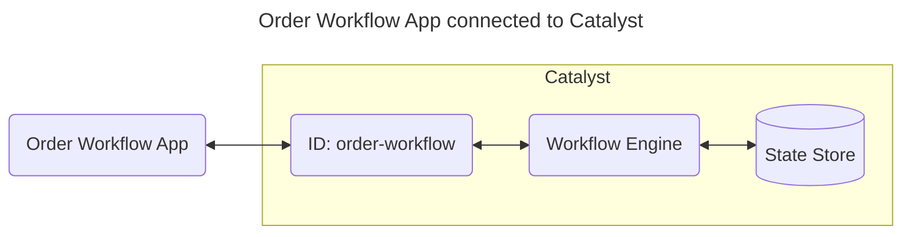
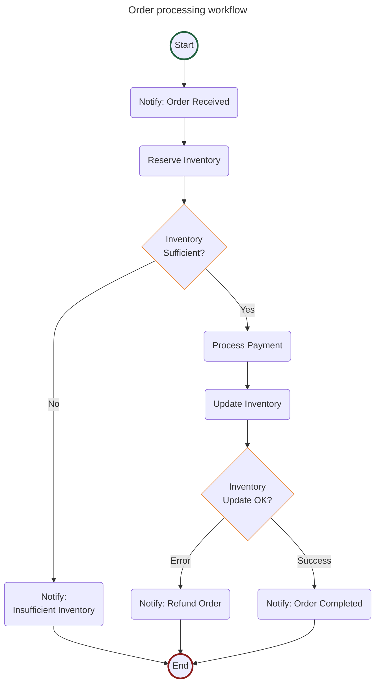

# Quickstart: Workflow (JavaScript)

In this quickstart, you'll run an order processing workflow on [Catalyst Cloud](https://docs.diagrid.io/operate/hosting/catalyst-cloud). You will learn how to:

- Provision a Catalyst project with a managed workflow engine using the Diagrid CLI.
- Run a stateful, multi-step order workflow that chains inventory checking, payment processing, and notification activities.
- Start, monitor, and inspect workflow executions using both the API and the Catalyst web console.



## 1. Prerequisites

Before you proceed, ensure you have the following prerequisites installed.

- [Diagrid Catalyst account](https://catalyst.diagrid.io/)
- [Diagrid CLI](https://docs.diagrid.io/getting-started/install-cli)
- [Git](https://git-scm.com/downloads)
- [Node.JS LTS](https://nodejs.org/en/)

## 2. Log in to Catalyst

Authenticate to Diagrid Catalyst using the following command:

```bash
diagrid login
```

This command opens a new browser window where you'll be shown a confirmation code that should match the code in your terminal. Confirm the code, and if you're not logged into Catalyst, you'll be redirected to login.

Confirm your user details are correct using the following command:

```bash
diagrid whoami
```

The expected output contains the name of the organization, your user name, and the Catalyst API endpoint.

## 3. Clone Quickstart Code

Clone the quickstart code from GitHub:

```bash
git clone https://github.com/diagridio/catalyst-quickstarts
```

Navigate to the quickstart directory:

**macOS/Linux:**

```bash
cd catalyst-quickstarts/workflow/javascript
```

**Windows:**

```powershell
cd catalyst-quickstarts\workflow\javascript
```

## 4. Install Dependencies

Install the dependencies for the workflow application.

```bash
npm install
```

## 5. Run the application with Catalyst Cloud

The `diagrid dev run` command creates your Catalyst project, provisions resources (apps, workflow engine, managed state store), configures environment variables, and launches your application connected to Catalyst Cloud.

```bash
diagrid dev run -f workflow-quickstart.yaml --project workflow-quickstart --approve
```

> **Tip:** Wait a few seconds until you see application logs in the terminal to ensure the application is up and running and connected to Catalyst.

## 6. Start and inspect a workflow instance

The **Order Processing** workflow chains notification, inventory, payment, and shipping activities, see the diagram for more details.



### 6.1 Start workflow

Open a new terminal and start a new workflow by making a POST request to the `start` endpoint:

**macOS/Linux (curl):**

```bash
curl -i -X POST http://localhost:5001/workflow/start -H "Content-Type: application/json" -d '{"name":"Car", "quantity":2}'
```

**Windows (PowerShell):**

```powershell
Invoke-RestMethod -Method Post -Uri "http://localhost:5001/workflow/start" -ContentType "application/json" -Body '{"name":"Car", "quantity":2}'
```

**Any OS (VS Code REST Client):** open [`test.rest`](./test.rest) and click *Send Request* above the request. Requires the [REST Client](https://marketplace.visualstudio.com/items?itemName=humao.rest-client) extension.

The response contains the workflow instance ID:

```json
{"instance_id":"<YOUR_INSTANCE_ID>"}
```

Copy the value from the response and save it as an environment variable for subsequent calls:

**macOS/Linux:**

```bash
export INSTANCE_ID=<YOUR_INSTANCE_ID>
```

**Windows:**

```powershell
$env:INSTANCE_ID = "<YOUR_INSTANCE_ID>"
```

### 6.2 Get workflow status

Get the workflow status by making a GET request to the `status` endpoint and providing the instance ID.

**macOS/Linux (curl):**

```bash
curl -i -X GET http://localhost:5001/workflow/status/$INSTANCE_ID
```

**Windows (PowerShell):**

```powershell
Invoke-RestMethod -Method Get -Uri "http://localhost:5001/workflow/status/$env:INSTANCE_ID" | ConvertTo-Json -Depth 3
```

**Any OS (VS Code REST Client):** open [`test.rest`](./test.rest) and click *Send Request* above the request — it reuses the instance ID from the start request automatically. Requires the [REST Client](https://marketplace.visualstudio.com/items?itemName=humao.rest-client) extension.

The response is the Dapr SDK's `WorkflowState` object for the instance, including its runtime status and creation and last-updated timestamps. Once the workflow has finished, the runtime status reads as completed.

### 6.3 View in the Catalyst web console

Open the [Workflow viewer](https://catalyst.diagrid.io/workflows/executions) in the Catalyst Cloud web console and select the workflow instance you just started to see a visual execution trace. The viewer displays each activity in sequence, its completion status, and the total workflow duration — useful for debugging long-running or failed executions.

## 7. Clean Up

Press CTRL+C in the terminal that runs `diagrid dev run` to stop the application and disconnect from Catalyst Cloud.

To delete the entire project and all provisioned resources:

```bash
diagrid project delete workflow-quickstart
```

## Summary

In this quickstart you:

- Logged in to Catalyst and provisioned a managed workflow project with a single CLI command (`diagrid dev run`).
- Ran an order processing workflow that's using task chaining.
- Inspected workflow execution state using the `status` endpoint and the Catalyst web console.

Catalyst handled workflow state durability, activity orchestration, and retries automatically — no infrastructure to manage.

## Next steps

- Explore the [Workflow SDK guides](https://docs.diagrid.io/develop/workflows) for building workflows from scratch, understanding workflow patterns, and resiliency.
- Try the [Workflow Composer](https://docs.diagrid.io/develop/workflows/workflow-composer) to scaffold workflow projects based on diagrams, or try the [Claude skills for Dapr](https://github.com/diagrid-labs/dapr-skills) to build entire Dapr workflow applications.
- Read the full [Workflow quickstart docs](https://docs.diagrid.io/getting-started/quickstarts/workflow).
- Browse all [Catalyst quickstarts](../../README.md) in this repository.
